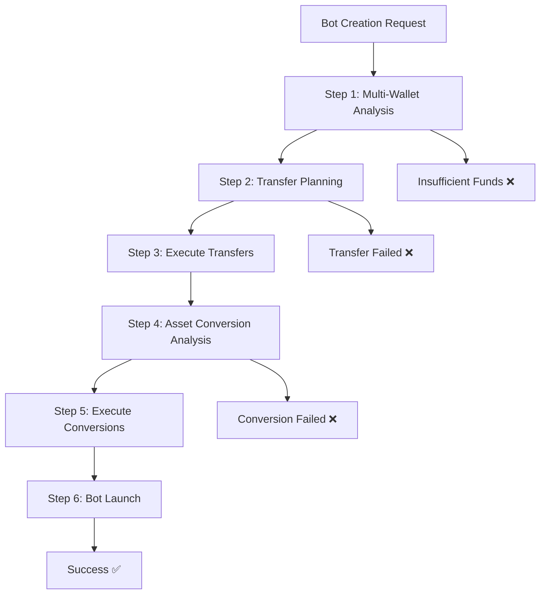

# 🚀 AUTOMATED ASSET MANAGEMENT SYSTEM

## Complete Inter-Wallet Transfer & Asset Swapping Solution for Bot Creation

---

## 📋 **OVERVIEW**

This system provides **fully automated asset management** for trading bot creation, handling both **asset conversions** (crypto-to-crypto swaps) and **inter-wallet transfers** (moving funds between different wallet types) seamlessly.

### **🎯 Key Capabilities:**
- ✅ **Multi-Wallet Balance Detection** across Spot, Futures, Cross Margin, and Isolated Margin
- ✅ **Intelligent Transfer Planning** based on trading strategy requirements
- ✅ **Automated Asset Conversion** with optimal path selection and slippage estimation
- ✅ **Batch Processing** for multiple operations with rate limit management
- ✅ **Integrated Bot Creation** with comprehensive preflight analysis

---

## 🏗️ **SYSTEM ARCHITECTURE**

### **Core Components:**

#### **1. Inter-Wallet Transfer Engine**
- **Multi-wallet balance fetching** across all account types
- **Strategy-based transfer planning** for optimal fund distribution
- **Automated transfer execution** with proper error handling
- **Real-time transfer tracking** and validation

#### **2. Asset Conversion Engine** 
- **Smart conversion path detection** (Direct, Via BUSD/BTC/ETH)
- **Batch processing** with parallel execution (3 assets at once)
- **Slippage estimation** and fee buffer management
- **Market order execution** with precision handling

#### **3. Integration Layer**
- **Bot creation workflow** with integrated preflight checks
- **Comprehensive error handling** and recovery mechanisms
- **Test frameworks** for validation and debugging

---

## 💰 **SUPPORTED WALLET TYPES**

| Wallet Type | Internal Code | Description | Transfer Support |
|-------------|---------------|-------------|-----------------|
| **Spot** | `MAIN` | Main trading account | ✅ All transfers |
| **Futures** | `UMFUTURE` | USD-M Futures margin | ✅ Spot ↔ Futures |
| **Cross Margin** | `MARGIN` | Cross margin account | ✅ Spot ↔ Margin |
| **Isolated Margin** | `ISOLATED` | Isolated margin pairs | ✅ Spot ↔ Isolated |
| **Funding** | `FUNDING` | Funding wallet | 🔄 Future support |
| **Earn** | `EARN` | Staking/savings | 🔄 Future support |

---

## 🔄 **TRANSFER WORKFLOWS**

### **Short Perp Strategy Requirements:**
```
📊 Analysis:
├── Spot Wallet: Needs USDT to buy base asset  
├── Futures Wallet: Needs USDT for margin
└── Auto-Transfer: Redistributes USDT as needed

🔄 Possible Transfers:
├── Futures → Spot: If Spot needs more USDT
├── Spot → Futures: If Futures needs margin
└── Margin → Either: If primary wallets insufficient
```

### **Long Perp Strategy Requirements:**
```
📊 Analysis:
├── Spot Wallet: Needs base asset to sell
├── Futures Wallet: Needs USDT for margin  
└── Auto-Transfer: Optimizes asset distribution

🔄 Possible Transfers:
├── Futures → Spot: Base asset for selling
├── Margin → Spot: Base asset backup source
└── Any → Futures: USDT for margin requirements
```

---

## 🔧 **API ENDPOINTS**

### **Multi-Wallet Operations:**
```http
POST /api/v1/get-all-wallet-balances
- Fetches balances across all wallet types
- Returns comprehensive asset distribution
- Includes error handling for inaccessible wallets
```

### **Transfer Planning & Execution:**
```http
POST /api/v1/plan-wallet-transfers
- Analyzes strategy requirements  
- Plans optimal transfer sequence
- Option: autoExecute for immediate execution

POST /api/v1/execute-wallet-transfer  
- Executes individual transfers
- Returns transfer ID for tracking
- Full error handling and validation
```

### **Enhanced Conversion Testing:**
```http
POST /api/v1/test-enhanced-conversion
- Tests conversion paths for assets
- Batch conversion analysis
- Slippage and path optimization
```

### **Integrated Bot Creation:**
```http  
POST /api/v1/launch-bot (Enhanced)
- Now includes automatic transfer planning
- Integrated asset conversion
- Complete preflight validation
```

---

## 🧪 **TESTING FRAMEWORK**

### **Asset Swapping Tests:** `test-asset-swapping.js`
- ✅ **Enhanced conversion paths** with slippage estimation
- ✅ **Batch processing** validation
- ✅ **Bot creation scenarios** testing
- ✅ **Dry-run and live modes** for safety

### **Wallet Transfer Tests:** `test-wallet-transfers-fixed.js`  
- ✅ **Multi-wallet balance detection**
- ✅ **Transfer planning scenarios**
- ✅ **Strategy-based optimization**
- ✅ **Safety controls** for live testing

---

## ⚡ **PERFORMANCE OPTIMIZATIONS**

### **Batch Processing:**
- **Parallel conversions:** Up to 3 assets simultaneously
- **Rate limit management:** 500ms delays between batches
- **Error isolation:** Individual failures don't stop the batch

### **Intelligent Caching:**
- **Exchange info caching:** 60-second TTL for symbol filters
- **Price data reuse:** Minimize API calls across operations
- **Balance consolidation:** Single fetch for multi-wallet analysis

### **Smart Path Selection:**
- **Priority-based routing:** Direct > BUSD > FDUSD > BTC > ETH
- **Slippage estimation:** 0.1% per hop for planning
- **Fallback mechanisms:** Multiple paths for reliability

---

## 🛡️ **SAFETY FEATURES**

### **Multi-Layer Validation:**
1. **API Key Validation:** Format and permission checking
2. **Balance Verification:** Real-time balance confirmation
3. **Transfer Limits:** Minimum amounts and dust protection
4. **Error Recovery:** Graceful handling of partial failures

### **Risk Management:**
- **Fee Buffers:** 0.1% safety margin for conversions
- **Minimum Values:** $5 USDT minimum for conversions  
- **Retention Buffers:** $10 USDT kept for operations
- **Dry-Run Modes:** Test all operations before execution

---

## 🚦 **WORKFLOW INTEGRATION**

### **Complete Bot Creation Process:**


### **Error Handling Flow:**
```
🔍 Detection → 📋 Planning → 🔄 Execution → ✅ Validation
     ↓              ↓           ↓           ↓
   ❌ Error → 🔄 Retry → ⚠️ Fallback → 📝 Report
```

---

## 📊 **MONITORING & LOGGING**

### **Comprehensive Logging:**
- `[WALLET-FETCH]` - Multi-wallet balance operations
- `[TRANSFER-PLAN]` - Strategy analysis and planning
- `[TRANSFER-EXECUTE]` - Individual transfer operations  
- `[CONVERT-PATH]` - Asset conversion path selection
- `[BATCH-CONVERT]` - Batch processing operations
- `[BOT-LAUNCH]` - Integrated bot creation process

### **Error Tracking:**
- **Transfer Failures:** Asset, amount, wallets, and reason
- **Conversion Issues:** Path failures and slippage problems
- **API Errors:** Rate limits and permission issues
- **Balance Discrepancies:** Expected vs actual amounts

---

## 🎯 **USAGE EXAMPLES**

### **Basic Transfer Planning:**
```javascript
const response = await fetch('/api/v1/plan-wallet-transfers', {
  method: 'POST',
  body: JSON.stringify({
    apiKey: 'your-api-key',
    apiSecret: 'your-api-secret', 
    symbol: 'BTCUSDT',
    strategyType: 'Short Perp',
    investment: 100,
    autoExecute: false // Plan only
  })
});
```

### **Integrated Bot Creation:**
```javascript
const botResponse = await fetch('/api/v1/launch-bot', {
  method: 'POST',
  body: JSON.stringify({
    // Bot parameters
    id: 'my-bot-123',
    name: 'BTC Short Perp',
    symbol: 'BTCUSDT',
    strategyType: 'Short Perp', 
    investment: 100,
    leverage: 5,
    
    // Automation parameters  
    autoConvert: true,  // Enable asset conversion
    dryRun: false,      // Execute for real
    
    // API credentials
    apiKey: 'your-api-key',
    apiSecret: 'your-api-secret'
  })
});

// Response includes:
// - preflight.transfers: Transfer operations performed
// - preflight.executed: Asset conversions completed
// - bot: Created bot details
```

---

## 🏁 **SYSTEM STATUS**

### **✅ COMPLETED FEATURES:**
- [x] **Multi-wallet balance detection** across all major wallet types
- [x] **Intelligent transfer planning** based on strategy requirements  
- [x] **Automated transfer execution** with comprehensive error handling
- [x] **Enhanced asset conversion** with optimal path selection
- [x] **Batch processing system** for parallel operations
- [x] **Integrated bot creation** with preflight validation
- [x] **Comprehensive test frameworks** for validation
- [x] **Production-ready logging** and monitoring

### **🔄 FUTURE ENHANCEMENTS:**
- [ ] **Funding wallet integration** for additional liquidity
- [ ] **Cross-chain transfers** for multi-blockchain support
- [ ] **Advanced slippage protection** with limit orders
- [ ] **Portfolio rebalancing** automation
- [ ] **Cost optimization** algorithms for transfer routing

---

## 🎉 **CONCLUSION**

The **Automated Asset Management System** provides a complete solution for trading bot creation with **zero manual intervention** required for fund management. The system intelligently:

1. **Analyzes** your wallet distribution across all account types
2. **Plans** optimal transfers based on trading strategy requirements  
3. **Executes** transfers and conversions automatically
4. **Validates** all operations before bot creation
5. **Reports** comprehensive results and handles any errors gracefully

**Result:** Seamless bot creation regardless of your current asset distribution! 🚀

---

*Built with ❤️ for the TaskMaster automated trading system.*
